## Hi, I'm Elena </h2>
### QA Engineer (Full-Stack Testing: UI, API, DB, Automation) 

* 🧡 Software test engineer, researcher & study coordinator
* 🐍 Python-based test automation

  

#### Languages/frameworks:
| Python | PyCharm | Git | Pytest | Requests | Selenium | Allure Report | Appium | Gitlab CI |
|--------|---------|-----|--------|----------|----------|---------------|--------|-----------|
| 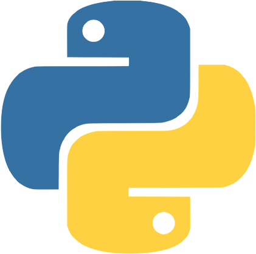  | 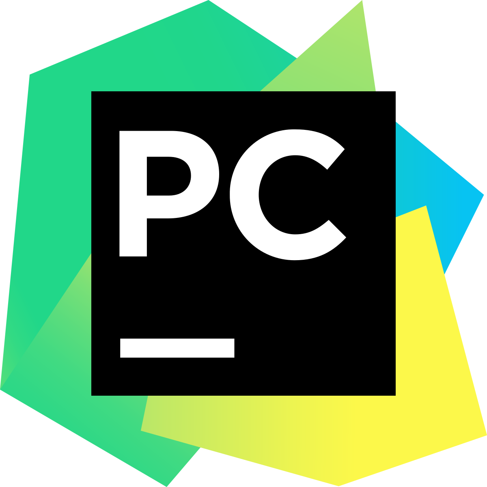  ||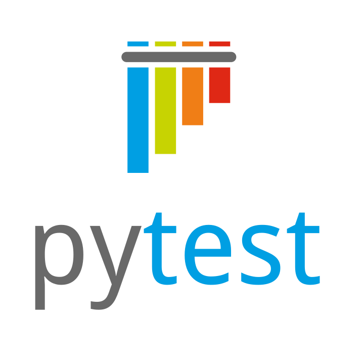 |  | | |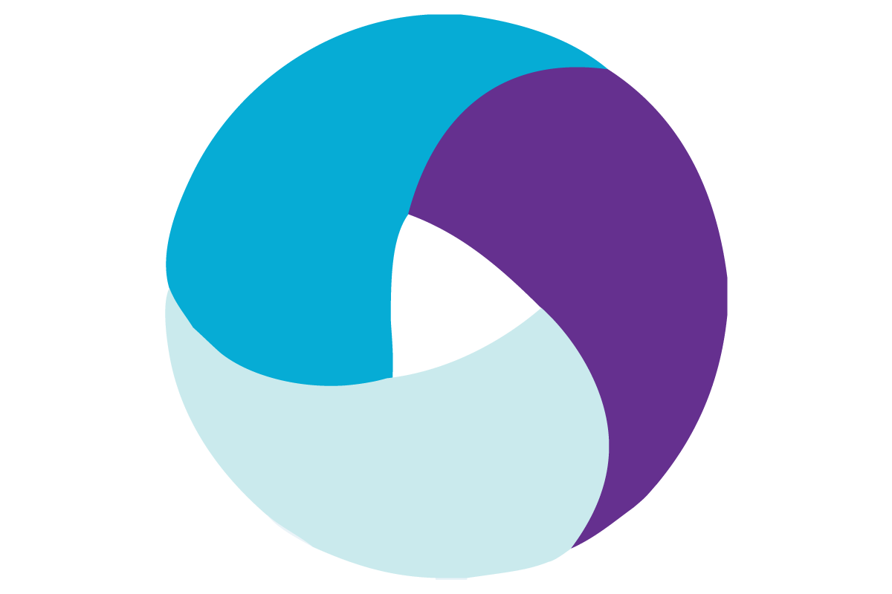 | |

#### API/integrations:
| Postman | Kafka | Swagger | REST | SOAP | Docker |  
|--------|---------|-----|--------|----------|----------|
|   | 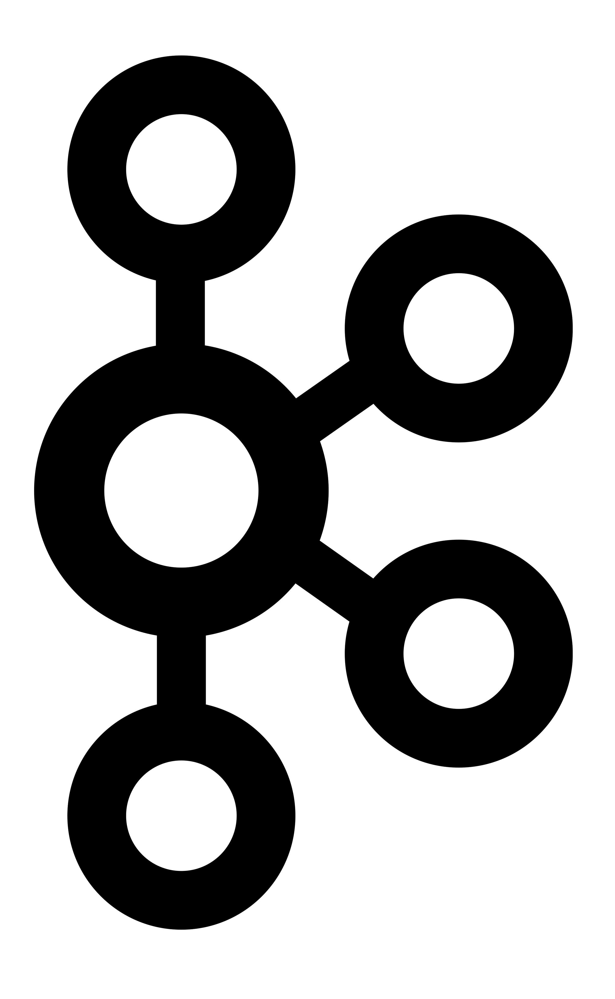  |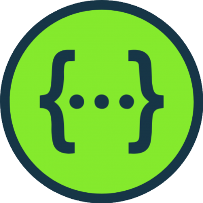|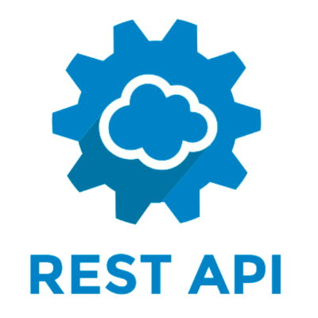 |  | |

#### WEB/mobile:
| Android Studio | Xcode | DevTools | Charles | Figma | HTML | CSS | Firebase | WireMock |
|--------|---------|-----|--------|----------|----------|---------------|--------|-----------|
| 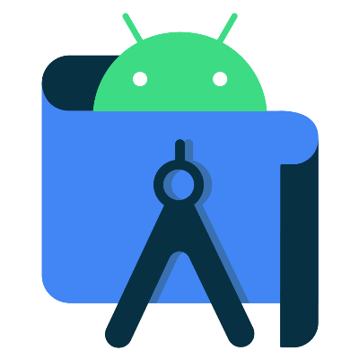  | 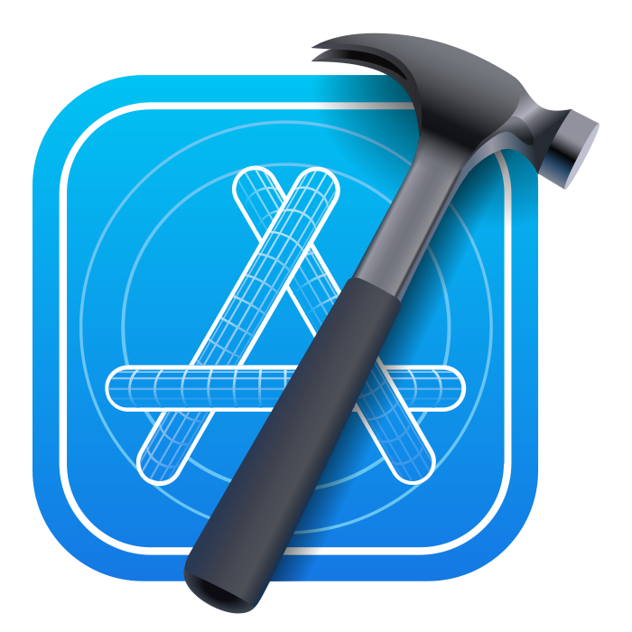  |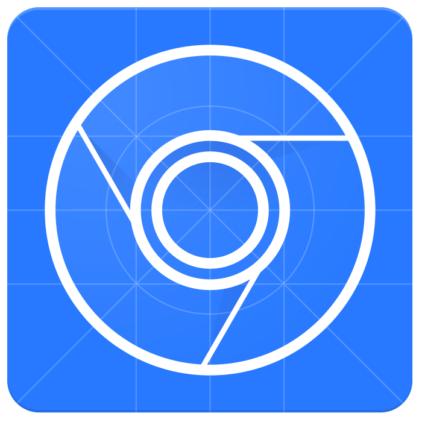|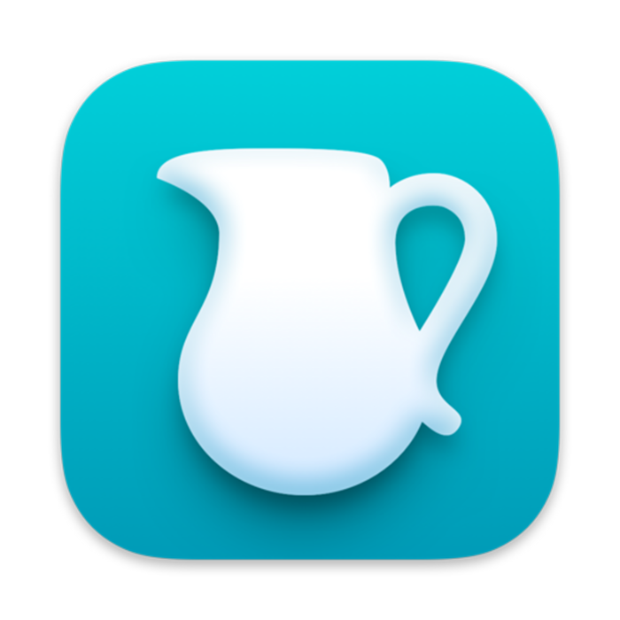 | 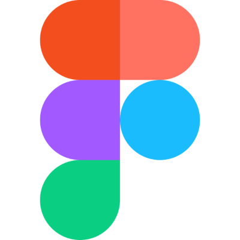 | | | | |

#### Logs/monitoring:
| Kibana | Grafana | Yandex Cloud | Jaeger | Sentry | Bash |
|--------|---------|-----|--------|----------|----------|
|   |   ||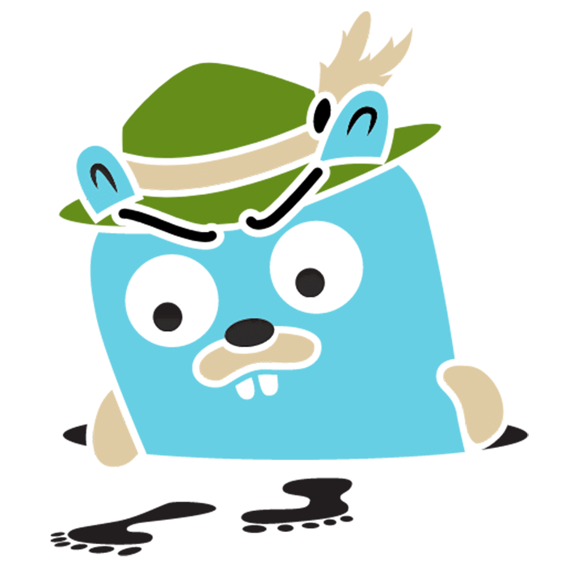 | 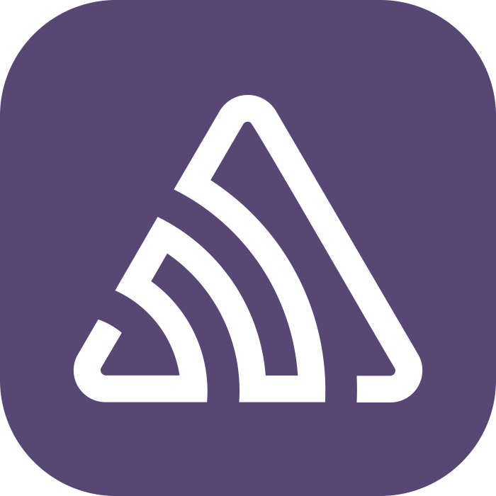 |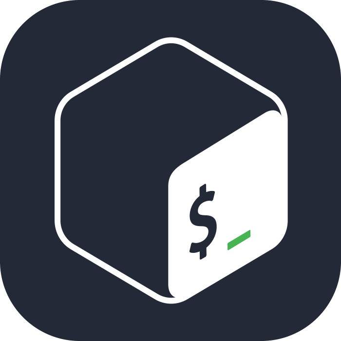 |

#### TMS:
| TestIT | YouTrack | ClickUp | Miro | TestRail | Zephyr | Jira | Confluence | Qase |
|--------|---------|-----|--------|----------|----------|---------------|--------|-----------|
|   |   || |  |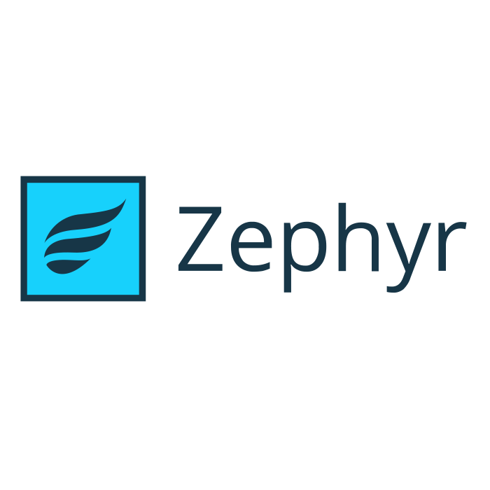 | |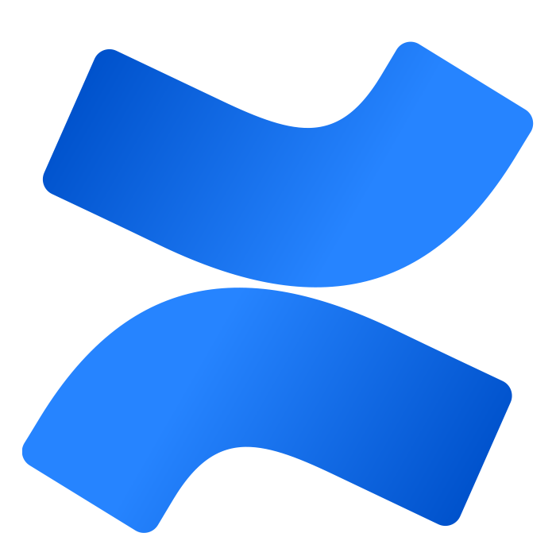 | |

#### Data bases:
| PostgreSQL | Redis | MongoDB | DBeaver |
|--------|---------|-----|--------|
| 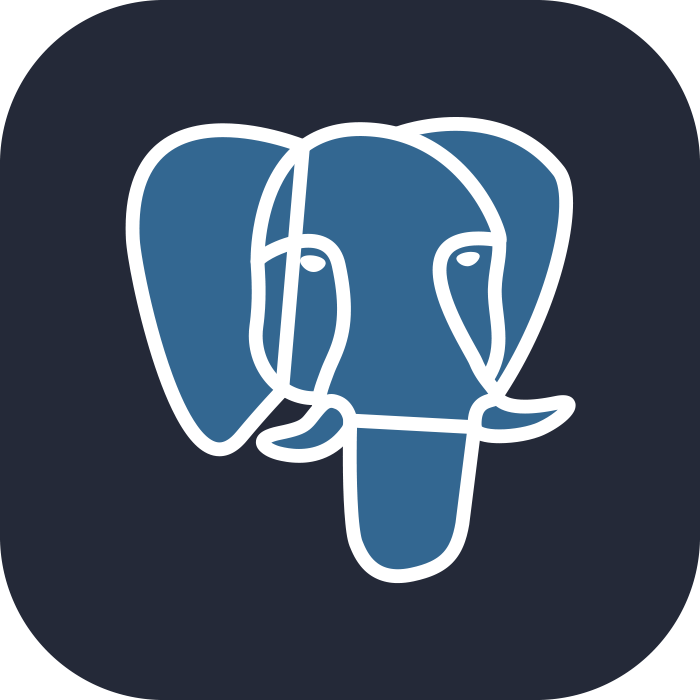  | 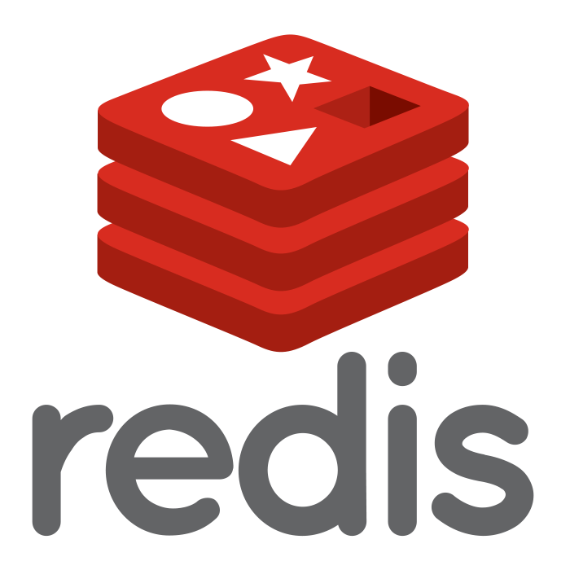  |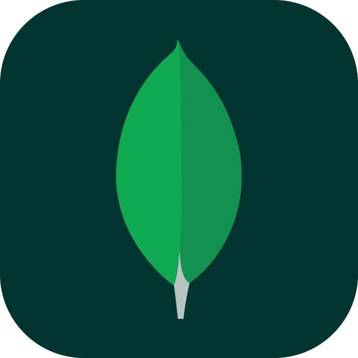| |

#### Projects:
| API My Shows Rating |  API pokemonbattle | UI pokemonbattle |
|---------------------|----------------------|--------------------|
|[my-shows-api-tests]()|[pokemonbattle-api-tests]()   | [pokemonbattle-e2e-tests]()   
| Pytest, Requests, Docker|Pytest, Requests, Gitlab CI| Selenium, Gitlab CI|

<!--
**persephonaart/persephonaart** is a ✨ _special_ ✨ repository because its `README.md` (this file) appears on your GitHub profile.

Here are some ideas to get you started:

- 🔭 I’m currently working on ...
- 🌱 I’m currently learning ...
- 👯 I’m looking to collaborate on ...
- 🤔 I’m looking for help with ...
- 💬 Ask me about ...
- 📫 How to reach me: ...
- 😄 Pronouns: ...
- ⚡ Fun fact: ...
-->
